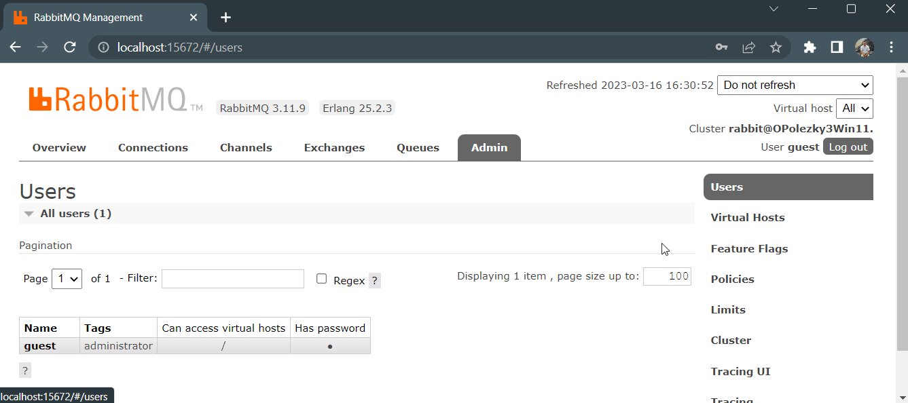

# RabbitMQ plugin to view and filter traces

## Table of Contents

- [Motivation](#motivation)
- [Features](#features)
- [How to use](#how-to-use)
- [Installation](#installation)
- [Quick Demo](#quick-demo)

## Motivation

Sometimes, during development or debugging, it's useful to be able to see every message that is published, and every message that is delivered. RabbitMQ has the [firehose](https://www.rabbitmq.com/firehose.html) feature and the [tracing plugin](https://blog.rabbitmq.com/posts/2011/09/rabbitmq-tracing-a-ui-for-the-firehose/) which allow recording and storing traces in files. Often there are a lot of published and delivered messages even for a short period, so the developers need to filter those traces.
</br>
<b>
The 'Tracing UI' plugin allows filtering traces produced by the tracing plugin.</b>

## Features

Traces are displayed in a table. Each trace field is displayed in the table column. The following features are implemented:

- Load trace files produced by the tracing plugin which is included in every RabbitMQ delivery.
- Filter out traces by multiple conditions. E.g. filter out by date and time, payload content, routed queues and keys, and others.
- Choose what columns to show/hide.
- Adjust columns widths.
- Optionally format JSON payload.
- Choose the displayed date and time format.
- All filter conditions and layout parameters are saved in the browser storage and are restored when the page is reloaded.

## How to use

- Install the plugin. The instructions are [here](#installation).
- Open the management plugin URL. The default for a single node on localhost is http://localhost:15672
- Click on the Admin tab.
- If you have already traces then you can move to the next step. To use the 'Tracing UI' plugin you need to have at least one trace file in JSON format. To create a trace file use the 'Tracing' plugin which is included in the RabbitMQ delivery.

  - Click on the 'Tracing' tab on the right side menu.
  - Expand the 'Add new trace' section
  - In this section type 'File Name', choose the 'JSON' format, and type the user name and the password. Optionally restrict 'Max payloads bytes' and Pattern.
  - Click on the 'Add trace' button.
  - Wait till some messages are published and delivered.
  - You can see trace files along with sizes in the table inside the 'All traces' section.
  - You can read more on the [Tracing plugin blog ](https://blog.rabbitmq.com/posts/2011/09/rabbitmq-tracing-a-ui-for-the-firehose/)
  - Once you have some records in a tracing file you can use the 'Tracing UI' plugin to filter them.

- Click on the 'Tracing UI' tab on the right side menu.
- In the 'File' dropdown choose a file with traces in JSON format. Then click on the 'Load File' button.
- To filter traces click on the 'Show Filter' button.
  - To add a filter condition click on the 'Add' button next to the 'Filter Conditions' section name.
  - Select a field to filter by. E.g. 'Date and Time'
  - Select an operator. E.g. 'after'
  - Enter a value. E.g. 5 minutes before current date and time.
  - To apply Click on the 'Apply' button.
  - To reset Click on the 'Reset' button .
  - To close the 'Filter Conditions' section click on the 'Hide Filter' button.
- To configure the table layout click on the 'Show Layout Config' button.
  - In the 'Columns Visibility' section you can check/uncheck columns to show/hide
  - In the 'Layout and Formatting' section you can:
    - Check the 'Adjust column widths. Then you can change the column width by dragging vertical gray lines on the right side of each column.
    - Check the 'Format Payload' to see the formatted JSON payload.
    - Choose the Date and time format to display.
  - While the Layout Config is visible use arrows in the table heading to change the order of columns.
  - To close the 'Layout Config' section click on the 'Hide Layout Config' button.

## Installation

- Download the plugin zip [from here](https://github.com/Polezky/rabbitmq-tracing-ui/raw/master/dist/rabbitmq_tracing_ui.zip)
- Navigate to RabbitMQ installation folder.

Linux, Mac OS

```shell
cd /usr/lib/rabbitmq/lib/rabbitmq_server-{x.y.z} # default path where {x.y.z} - is version
```

Windows

```shell
cd "C:\Program Files\RabbitMQ Server\rabbitmq_server-{x.y.z}" # default path where {x.y.z} - is version
```

- Navigate to the 'plugins' folder inside the RabbitMQ folder
- Unzip the content of the downloaded rabbitmq_tracing_ui.zip to rabbitmq_tracing_ui folder
- Navigate back to the RabbitMQ folder and then navigate to the 'sbin' folder
- Enable plugin:

```shell
rabbitmq-plugins enable rabbitmq_management rabbitmq_tracing rabbitmq_tracing_ui
```

- Restart RabbitMQ:

Linux, Mac OS

```console
sudo systemctl stop rabbitmq-server
sudo systemctl start rabbitmq-server
```

Windows

```console
net stop RabbitMQ
net start RabbitMQ
```

## Quick Demo


